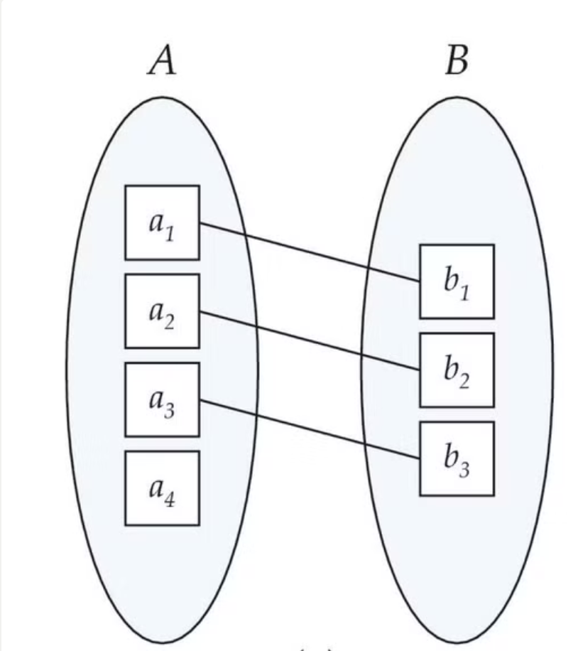
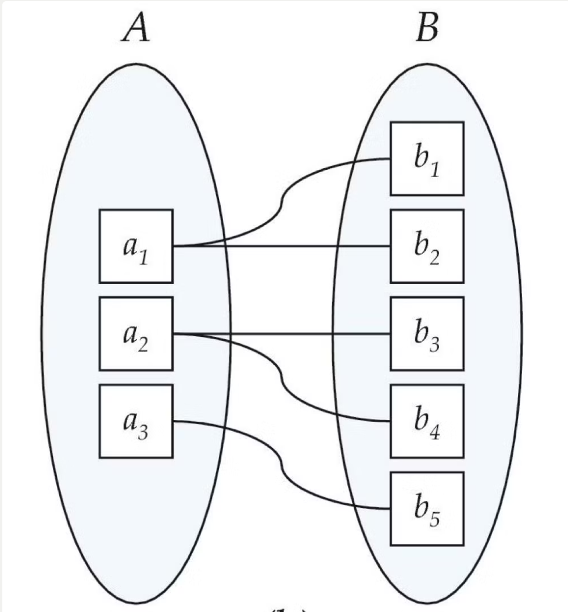
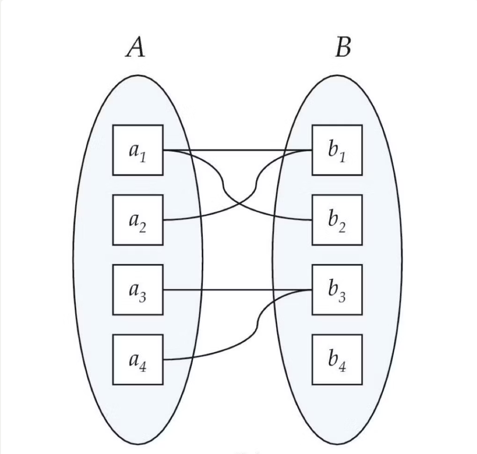

# 외래키
<blockquote>
<h2 style="font-weight: bold">다른 릴레이션의 primary key를 참조하는 속성 또는 속성들의 집합</h2>
<h3>참조하는 릴레이션 &Rightarrow; 외래키를 포함하고 있는 릴레이션 
참조 릴레이션 &Rightarrow; 대응되는 기본키를 포함하는 릴레이션
</h3>
</blockquote>

# 기본키
<blockquote>
<h2 style="font-weight: bold">후보키 중에서 특별히 선정된 키로 한 릴레이션에서 특정 튜플을 유일하게 구별할 수 있는 속성</h2>
<h3>후보키 &Rightarrow; 릴레이션에서 튜플을 유일하게 식별할 수 있는 속성들의 부분집합</h3>
* 유일성 O, 최소성 O
<h3>슈퍼키 &Rightarrow; 릴레이션 내에 있는 속성들의 집합으로 구성된 키 </h3>
* 유일성 O, 최소성 X
<h3>참조하는 릴레이션 => 외래키를 포함하고 있는 릴레이션 
참조 릴레이션 => 대응되는 기본키를 포함하는 릴레이션
</h3>
</blockquote>

# ER 다이어그램
<blockquote>
<h2 style="font-weight: bold">개체와 개체 간의 관계를 기본 요소로 이용하여 현실 세계의 데이터를 개념적인 논리 데이터로 표현하기 위한 방법</h2>
<h3>Entity &Rightarrow; 현실에세 개념적 또는 물리적으로 존재하는 것</h3>
ex) 학색, 교수, 자동차, 고객, 주문서 등
<h3>Relationship &Rightarrow; Entity 사이의 관계를 표현</h3>
<h3>Attribute &Rightarrow; Entity를 묘사하는 데 사용될 수 있는 특성</h3>
ex) 나이, 주소, 아이디, 비밀번호 등
<h3>E-R Model</h3>
- 개념적 설계에서 작성
- Entity와 Relationship을 이용해 현실 세계를 표현
- 특정 DBMS를 고려하지 않음
- 1:1, 1:N, N:M 등 다양한 관계 유형을 표현 가능
</blockquote>

# 복합키
<blockquote>
<h2 style="font-weight: bold">두 개 이상의 컬럼을 key로 지정하는 것</h2>
* 하나의 컬럼만 가지고 각 튜플을 구분할 수 없을 경우 두 개 이상의 컬럼을 조합하여 사용
</blockquote>

# 연관관계
<blockquote>
<h2 style="font-weight: bold">1:1 관계</h2>
- 양쪽 모두 하나씩 존재하는 경우 

<h2 style="font-weight: bold">1:N 관계</h2>
- 하나의 원소가 두 개 이상의 원소와 관계를 맺는 것  

<h2 style="font-weight: bold">N:M 관계</h2>
- 양쪽 모두 하나 이상 연관될 수 있는 관계 
* N:M 관계는 중간 테이블을 생성하여 1:N 과 1:M 관계로 변환

</blockquote>

# 정규화
<blockquote>
<h2 style="font-weight: bold">하나의 종속성이 하나의 릴레이션으로 표현될 수 있도록 분해하는 과정</h2>
<ul>
<li>논리적 설계 단계에서 수 </li>
<li>일관성, 정확성, 단순성, 비중복성, 안정성 등을 보장</li>
<li>정규화 수준이 높을 수록 유연한 데이터 구축이 가능하고 데이터 정확성이 높아짐</li>
</ul>
<h2>정규화 목적</h2>
<ul>
<li> 데이터 구조의 안정성과 무결성 유지</li>
<li> 이상현상(Anomaly) 방지 및 자료 저장 공간 최소화</li>
<li> 효과적인 검색 알고리즘 생성 가능</li>
<li> 데이터 모형 단순화</li>
<li> 자료 검색과 추출의 효율성 추구</li>
</ul> 
<h2>정규화 원칙</h2>
<ul>
<li>정보의 손실이 있어서는 안됨</li>
<li>하나의 독립된 관계성은 하나의 독립된 릴레이션으로 분리시켜 표현해야 함</li>
<li>데이터의 중복성이 감소해야 함</li>
</ul>
<h2>정규화 종류</h2>
<h3>1NF</h3>
&Rightarrow; 모든 도메인이 원자값으로 구성
<h3>2NF</h3>
&Rightarrow; 1NF + 기본키가 아닌 모든 속성이 기본키에 대하여 완전 함수적 종속 
<==> 부분 종속 제거
<h3>3NF</h3>
&Rightarrow; 2NF + 릴레이션에서 이행적 함수 종속을 제거
<h3>BCNF</h3>
&Rightarrow; 3NF + 모든 결정자가 후보키
<ul>
<li>키가 아닌 모든 속성은 각 키에 대해 완전 종속</li>
<li>키가 아닌 속성은 자신이 부분적으로 들어가 있지 않은 모든 키에 대해 완전 종속</li>
<li>어떤 속성도 키가 아닌 속성에 대해서는 완전 종속일 수 없음</li>
</ul>
<h3>4NF</h3>
&Rightarrow; 다치 종속 제거
<h3>5NF</h3>
&Rightarrow; 모든 조인 종속이 릴레이션의 후보키를 통해서만 성립하는 정규형
</blockquote>

# 반정규화
<blockquote>
<h2 style="font-weight: bold">시스템의 성능 향상, 개발 및 운영의 편의성 등을 위해 정규화된 데이터 모델을 통합, 중복, 분리하는 과정으로 의도적으로 정규화 원칙을 위배하는 것</h2>
* 반정규화를 통해 시스템의 성능 향상 및 관리 효율성 증가
<h2>반정규화 방법</h2>
<h3>1. 테이블 통합</h3>
<ul><li>두 개의 테이블이 Join되는 경우가 많아 하나의 테이블로 합쳐서 사용하는 것</li></ul>
<h3>2. 테이블 분할</h3>
<ul>
<li>테이블이 가진 데이터가 많은 것에 비해 사용하는 데이터가 한정되어 있거나 일정 부분에 집중적으로 접근할 때 필요한 테이블을 분할해서 사용하는 것</li>
<li>수평 분할과 수직 분할이 있음</li>
</ul>
<h3>3. 중복 테이블 추가</h3>
<ul>
<li>여러 테이블에서 데이터를 추출해서 사용해야 하거나 다른 서버에 저장된 테이블을 이용해야 하는 경우 사용</li>
<li>정규화로 인해 수행 속도가 느려지거나 특정 범위 혹은 많은 범위의 데이터를 자주 처리해야 하는 경우 사용</li>
<li>집계 테이블 추가, 진행 테이블 추가, 특정 부분만 포함하는 테이블 추가 등의 방법이 있음</li>
</ul>
<h3>4. 중복 속성 추가</h3>
<ul>
<li>join해서 데이터를 처리할 때 데이터를 조회하는 경로를 단축하기 위해 속성을 추가하는 것</li>
<li>데이터 무결성 확보가 어려움</li>
<li>조인 연산이 자주 발생하거나 접근 경로가 복잡한 경우 사용</li>
</ul>
</blockquote>